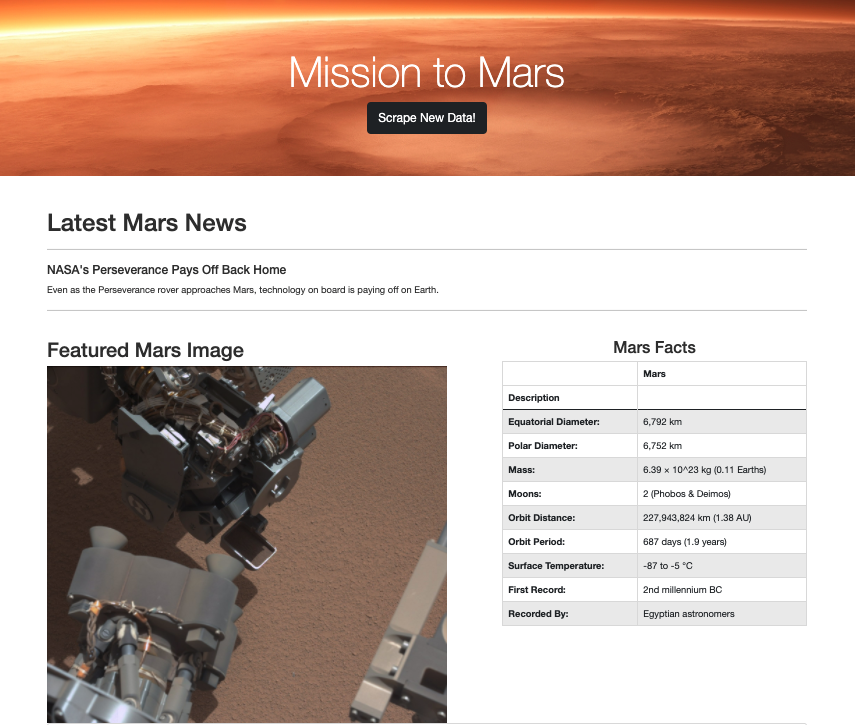
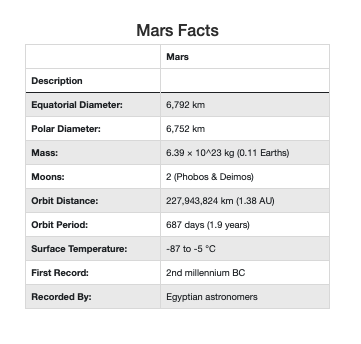
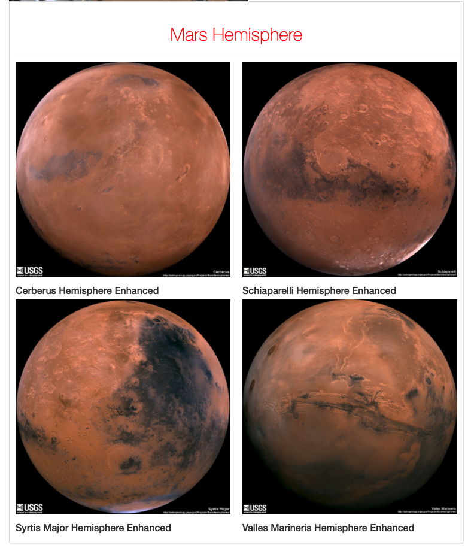

# **Web Scraping Homework**
## Mission to Mars

Built a web application that scrapes various websites for data related to the Mission to Mars and displays the information in a single HTML page. The following outlines what was done.

* Completed initial scraping using Jupyter Notebook, BeautifulSoup, Pandas, and Requests/Splinter.

* Created a Jupyter Notebook file called [`mission_to_mars.ipynb`](https://github.com/Kpearson72/web-scraping-challenge/blob/main/mission_to_mars.ipynb) and used this to complete all scraping and analysis tasks. 

## Step 1 - Scraping
### NASA Mars News

* Scrape the [NASA Mars News Site](https://mars.nasa.gov/news/) and collect the latest News Title and Paragraph Text. Assign the text to variables that you can reference later.

### Mars Facts

* Visited the Mars Facts webpage [here](https://space-facts.com/mars/) and used Pandas to scrape the table containing facts about the planet including Diameter, Mass, etc.

* Used Pandas to convert the data to a HTML table string.

### Mars Hemispheres

* Visit the USGS Astrogeology site [here](https://astrogeology.usgs.gov/search/results?q=hemisphere+enhanced&k1=target&v1=Mars) to obtain high resolution images for each of Mar's hemispheres.

## Step 2 - MongoDB and Flask Application

* Use MongoDB with Flask templating to create a new [HTML](https://github.com/Kpearson72/web-scraping-challenge/blob/main/templates/index.html) page that displays all of the information that was scraped from the URLs above.

## Step 3 - Submission

1. The [Jupyter Notebook](https://github.com/Kpearson72/web-scraping-challenge/blob/main/mission_to_mars.ipynb) containing the scraping code used.

2. Screenshots of your final application.
   
    
   
